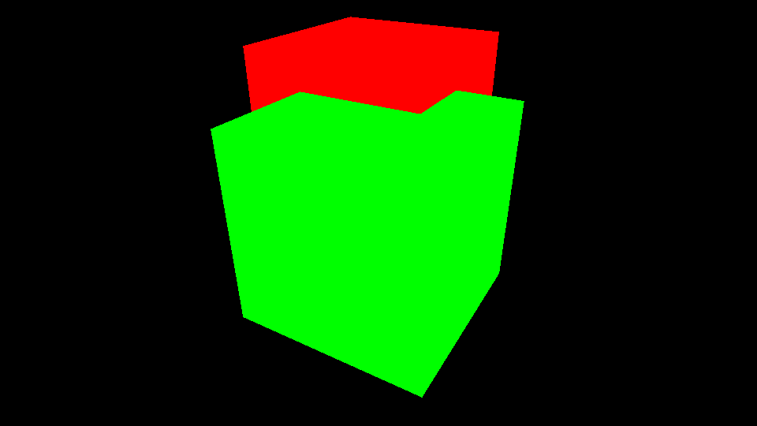
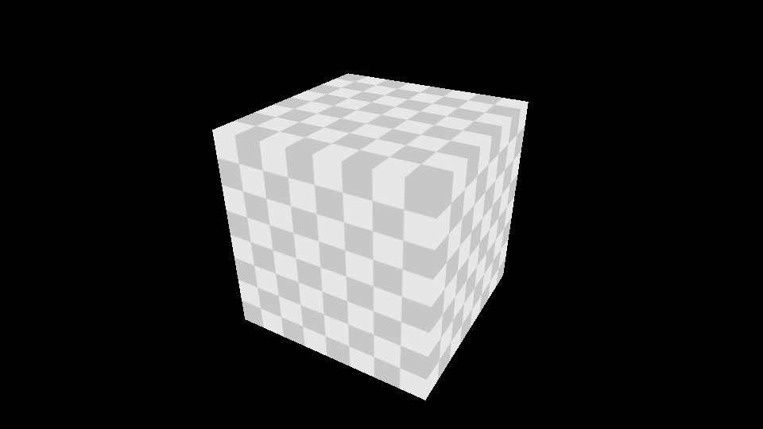

pixpad
======
Computer graphic experiment framework.

Build
=====
Dependent 3rd libs:
* boost
* zlib
* libpng
* openexr (IlmBase)

### Windows
Use CMake (at least 3.3) to configure the build.

Feature
====
- Sparrow: multi-threading software renderer for CG experiment.
	- Command based renderer with easily extended command set. Send command from one thread, render in another thread. 
	- Programmable pipeline with multi-threading support. All processings are run in parallel to speed up.
	- Flexible material system. It's very easy to write your own vertex/fragment shader. 
	- Basic render features, such as depth test, texture mapping, etc. More are coming.

Roadmap
====

- mipmap & trilinear sampler
- anitaliasing
- improved metrics
- tile based memory layout
- more are coming...

Gallery
====

